<div align="center">
  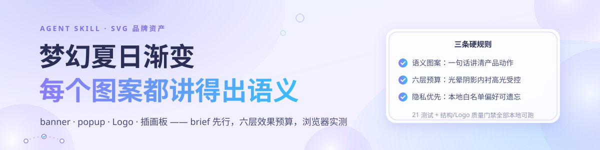
</div>

<div align="center">

# ✨ svg-optimization-skill

### 梦幻、夏日、有空气感的 SVG 品牌资产技能。

一句 brief → 语义化图案 → 六层效果预算 → 浏览器实测，
**banner · popup · Logo · 插画板**一套画完，全部零运行时依赖、本地可验证。

[](LICENSE)
[](tests)
[](package.json)

</div>

> [!IMPORTANT]
> 示例里的「知了学习」是演示品牌（知识组织与核验的学习工具）。所有资产都是手写 SVG：
> 没有运行时依赖、没有字体包、没有位图素材。偏好学习只写本地白名单数字权重，
> 原始反馈永不落盘——见 [`PRIVACY.md`](PRIVACY.md)。

**目录**

- 🎯 [它解决什么](#-它解决什么) · ✨ [效果一览](#-效果一览真机渲染) · 🧱 [六层效果预算](#-六层效果预算) · 🎨 [主题方向](#-主题方向)
- 🧭 [你能这样用](#-你能这样用) · 🚀 [安装与验证](#-安装与验证) · 🔒 [隐私边界](#-隐私边界) · 📄 [许可](#-许可)

## 🎯 它解决什么

做品牌 SVG 资产最常见的五种翻车，这个技能都写成了硬规则：

- **装饰靠随机**：光晕、圆点、花朵随手堆，不好看也说不清哪里不对 → 每个主图案先写一句 brief（message / visual nouns / relationship），讲不清就删，不许加装饰救场。
- **文字溢出**：SVG 的 `<text>` 不会撑开容器，标题总被裁掉一截 → 先离线测量（`scripts/measure_text.html`），再回填坐标，浏览器里迭代验证。
- **Logo = 图标 + 色块**：没有语义层次，48 px 一缩就糊 → 固定语义 brief（翻开的知识材料 + 核验），外环节点、盾牌、内衬、高光各就各位，缩略预览随产随验。
- **风格每次重摇**：每张图各画各的渐变 → J/K/L 三套季节主题共享同一文案与 Logo 语义，只换色板与材质。
- **偏好不留存**：用户说过的口味第二天就忘 → 本地白名单偏好 CLI，`record / forget / reset` 可控可遗忘，永不上传。

## ✨ 效果一览（真机渲染）

下面全部是仓库内的 **SVG 源文件**直接引用，点进去就是可复制的资产。

<div align="center">
  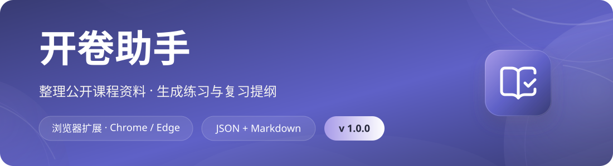
  <br/>
  <sub><strong>正式 banner（1100×300）</strong> —— 默认 J 梦幻极光：环境光晕 + 边缘裁切气泡 + 语义 Logo。</sub>
</div>

<table>
  <tr>
    <td width="46%" valign="top">
      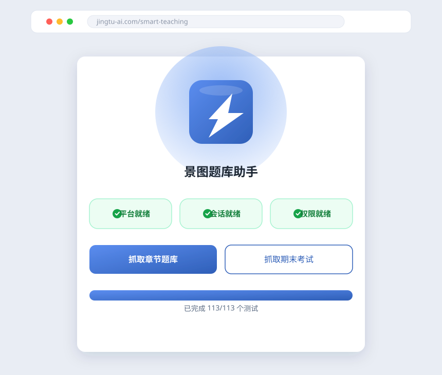
      <br/>
      <sub><strong>弹窗 mockup（860×730）</strong> —— 深色浏览器背景，三个语义功能行 + 主 CTA。</sub>
    </td>
    <td width="54%" valign="top">
      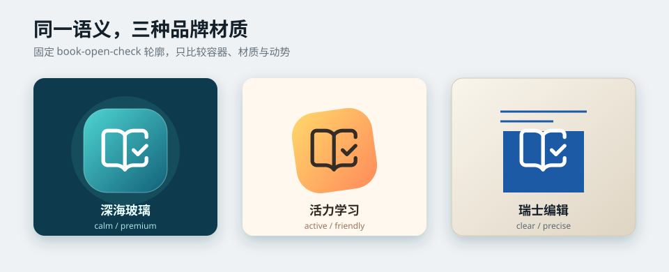
      <br/>
      <sub><strong>Logo 精修对比</strong> —— 外环节点 / 内衬 / 高光 / 盾牌全解，含 48 px 缩小预览。</sub>
    </td>
  </tr>
</table>

<div align="center">
  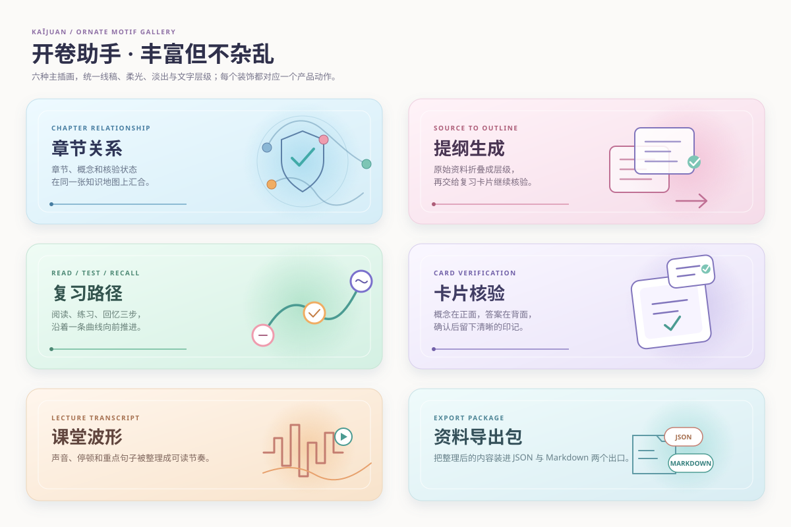
  <br/>
  <sub><strong>六卡语义插画</strong> —— 章节关系 / 提纲生成 / 复习路径 / 卡片核验 / 课堂波形 / 资料导出包，每张一句话讲清。</sub>
</div>

<div align="center">
  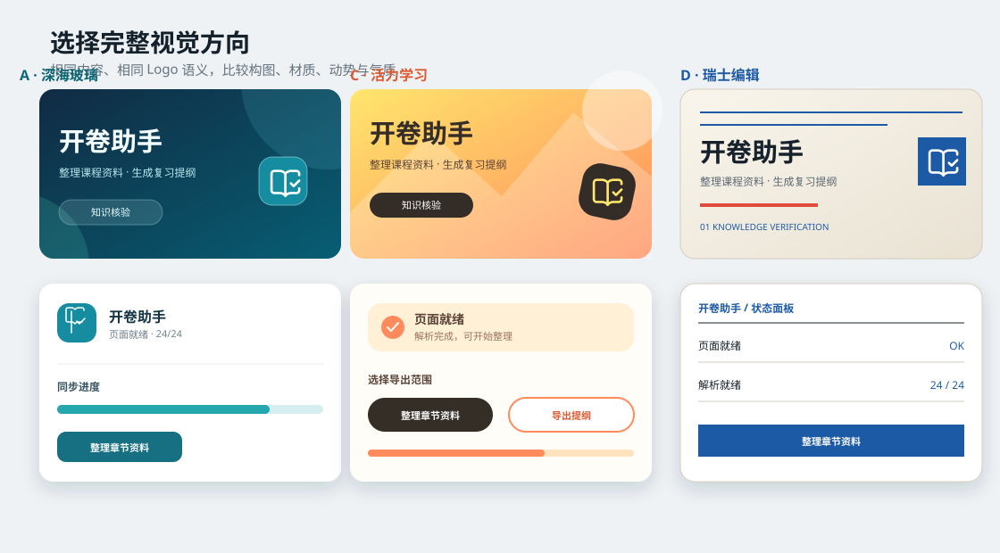
  <br/>
  <sub><strong>风格选择器 · 基础三方向（J/K/L）</strong> —— 风格未定就先给完整方向：banner 缩略 + popup 局部一起看，选定再生成终稿。</sub>
</div>

<div align="center">
  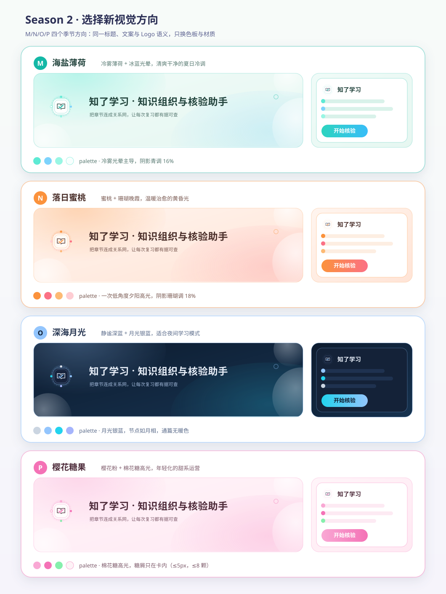
  <br/>
  <sub><strong>风格选择器 · Season 2（M/N/O/P）</strong> —— 冷雾薄荷 / 落日蜜桃 / 深海月光（暗色夜间模式）/ 樱花糖果，同一文案与 Logo 语义只换色板。</sub>
</div>

<div align="center">
  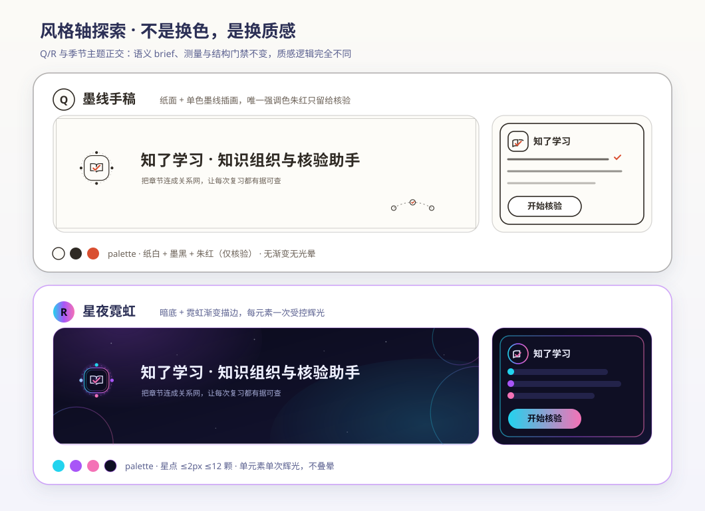
  <br/>
  <sub><strong>风格轴探索（Q/R）</strong> —— 不是换色而是换质感：纸面墨线单色手稿（朱红只给核验）与暗底霓虹受控辉光。</sub>
</div>

<table>
  <tr>
    <td width="52%" valign="top">
      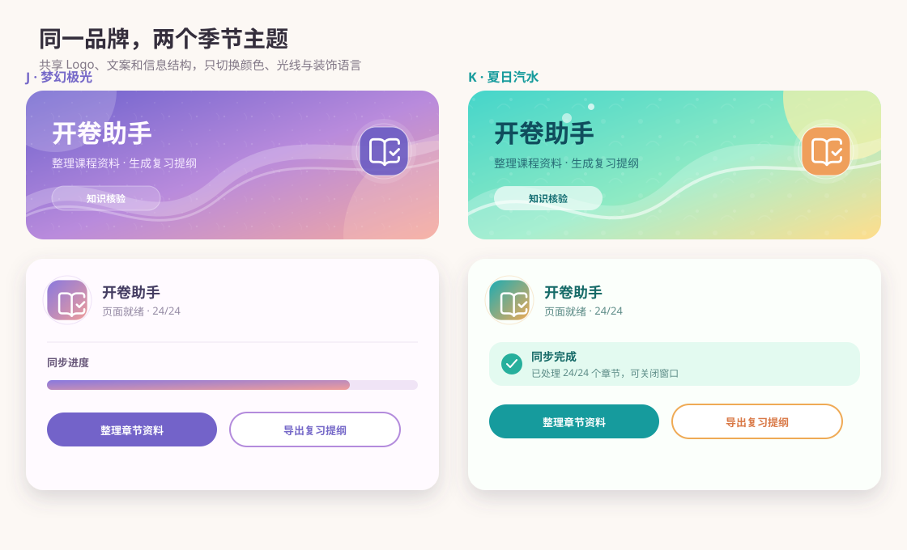
      <br/>
      <sub><strong>J×K 双主题套系</strong> —— 默认一个，另一个随季节切换。</sub>
    </td>
    <td width="48%" valign="top">
      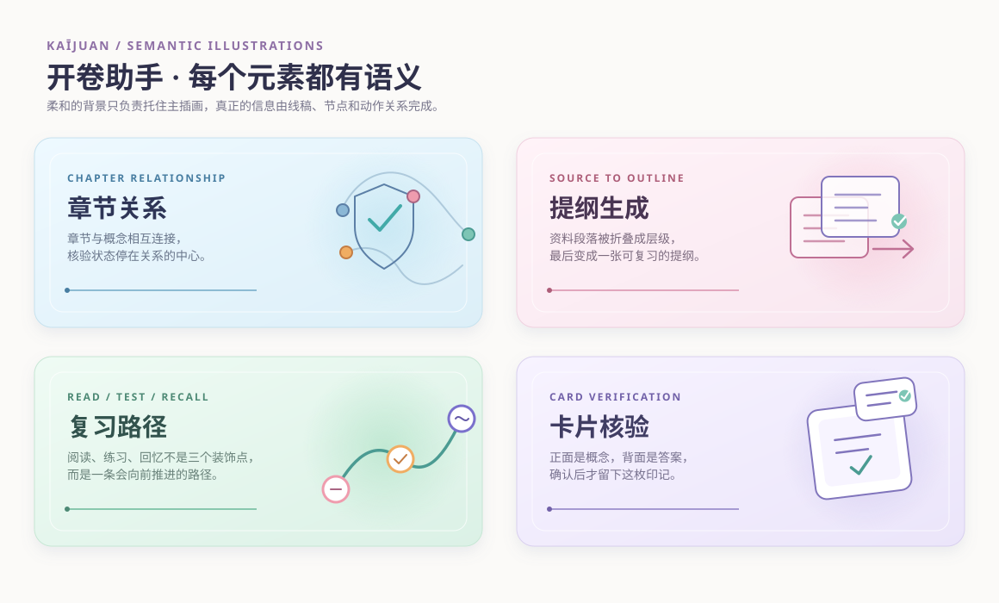
      <br/>
      <sub><strong>四卡基础插画语法</strong> —— 统一线宽、每卡最多两个强调色。</sub>
    </td>
  </tr>
</table>

## 🧱 六层效果预算

空气感不是堆出来的，是按预算叠出来的：

<div align="center">
  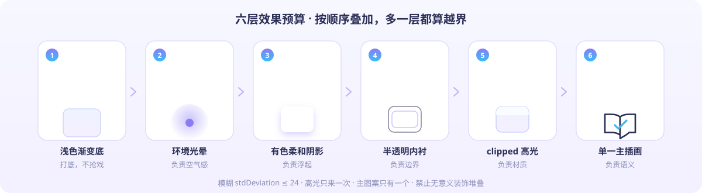
</div>

规则只有一句话：**顺序不能乱，层数不能加**。模糊 `stdDeviation ≤ 24`，高光只来一次，
主图案只有一个；无界 blur、重复 glow、随机小圆点堆叠一律判定不合格
（[`references/design-patterns.md`](references/design-patterns.md) §5，
[`evals/grade.mjs`](evals/grade.mjs) 会自动检查）。

## 🎨 主题方向

### 季节轴（同一文案与 Logo 语义，只换色板与材质）

| 方向 | 气质 | 状态 |
| --- | --- | --- |
| **J · 梦幻极光** | 紫罗兰光晕 + 青色节点，空气感最强 | ✅ 默认主题，已应用正式 banner / popup |
| **K · 夏日汽水** | 青柠气泡 + 珊瑚点核，清爽活力 | ✅ 季节切换主题 |
| **L · 暖阳纸片** | 暖纸卡片 + 阳光高光，安静学习氛围 | 备选（见基础风格选择器） |
| **M · 海盐薄荷** | 冷雾薄荷 + 冰蓝，干净冷调 | Season 2 |
| **N · 落日蜜桃** | 蜜桃珊瑚晚霞，温暖治愈 | Season 2 |
| **O · 深海月光** | 静谧深蓝 + 月光银蓝，夜间模式 | Season 2 |
| **P · 樱花糖果** | 樱花粉 + 棉花糖高光，甜系运营 | Season 2 |
| A · 深海气泡 | 原始深蓝版 | 冻结为回归基线 [`banner-deepsea-baseline.svg`](assets/examples/banner-deepsea-baseline.svg) |

### 风格轴（不换色，换质感；与季节轴正交）

| 方向 | 质感逻辑 | 约束 |
| --- | --- | --- |
| **Q · 墨线手稿** | 纸面 + 单色墨线插画，无渐变无光晕 | 唯一强调色朱红只留给核验标记 |
| **R · 星夜霓虹** | 暗底 + 霓虹渐变描边，星点点缀 | 每元素单次受控辉光，星点 ≤ 2 px 且 ≤ 12 颗 |

风格轴探索可放宽六层色板传统，但**不放宽**语义 brief、文字测量与结构门禁
（[`references/style-system.md`](references/style-system.md) §2–3）。
所有方向共享同一标题、文案、Logo 语义与画布；风格未定或用户说"太简单/不好看"
时，技能先产出完整方向（见上面三块选择器）让用户选，再生成终稿。

## 🧭 你能这样用

| 场景 | 你可以这样问 |
|---|---|
| 新建资产 | "给产品做 1100×300 推广 banner，J 主题。" |
| 风格未定 | "banner 重新设计，给我几个方向选。" |
| 修溢出 | "副标题溢出了，先测量再修。" |
| Logo 精修 | "Logo 要经得起 48px 缩小，把层次补齐。" |
| 图案审查 | "这张卡太像拼贴了，删掉无关元素。" |
| 记忆口味 | "记住我更喜欢玻璃质感。"（走白名单 CLI，可随时 `forget`） |

标准工作顺序：写 brief → 选方向 → 六层预算绘制 → 测量回填 → `npm test` + `npm run check` → 浏览器实测。

## 🚀 安装与验证

### 方式一：交给 Agent（推荐）

```text
请安装这个 Agent Skill：https://github.com/jing1312/svg-optimization-skill
先审查 SKILL.md 与 references/，再整目录安装到你的 skills 目录。
```

### 方式二：手动安装

```bash
git clone https://github.com/jing1312/svg-optimization-skill.git
cp -R svg-optimization-skill ~/.codex/skills/   # 或 ~/.claude/skills/、~/.agents/skills/
```

### 本地验证（零依赖，Node ≥ 18）

```bash
npm test        # 21 项：偏好 CLI + 隐私扫描 + SVG 结构 + Logo 门禁
npm run check   # XML well-formedness + Logo 质量评估（8 个示例资产）
node evals/grade.mjs path/to/any.svg   # 单独评估某个文件
```

### 本地偏好 CLI

```bash
node scripts/preferences.mjs show
node scripts/preferences.mjs record --key material.glass --delta 1
node scripts/preferences.mjs forget --key material.glass
node scripts/preferences.mjs reset
```

文字测量用 [`scripts/measure_text.html`](scripts/measure_text.html)：
浏览器双击打开，粘贴文案即可得到预留宽度，尺子全局一致。

## 🔒 隐私边界

- 公开仓库永不收录：原始聊天 / 原始反馈 / 内部交接、私有 prompt、项目路径、用户名、任何凭证。
- 偏好持久化只允许白名单数字权重（`material.glass`、`palette.dark_cyan` 等），
  `forget` / `reset` 是物理删除，不是打标记。
- 偏好只改变推荐顺序，不替用户自动选择，也不改写公开 `SKILL.md`。
- 完整条款见 [`PRIVACY.md`](PRIVACY.md)；仓库测试里有一条隐私扫描用例会在 CI 之外替你守门。

## 📄 许可

项目本体 [ISC](LICENSE)；Logo 核心 glyph 改编自 Lucide `book-open-check`（同为 ISC），
归属见 [`THIRD_PARTY_NOTICES.md`](THIRD_PARTY_NOTICES.md)。
欢迎提 Issue / PR：新主题、新图案语法或更严的质量门都可以。
