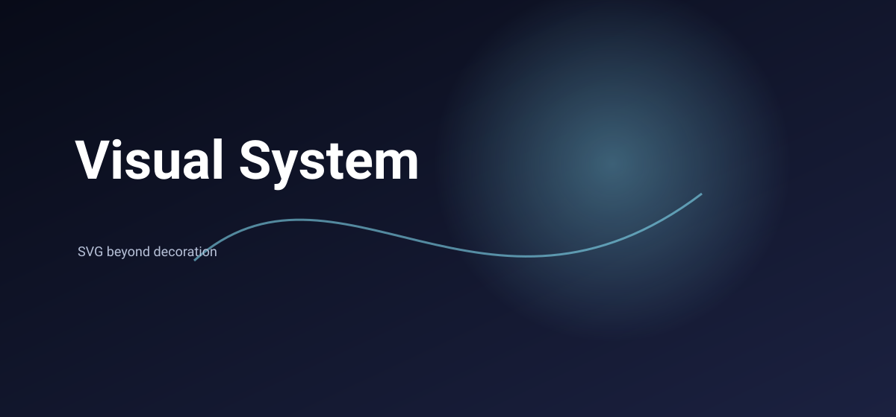
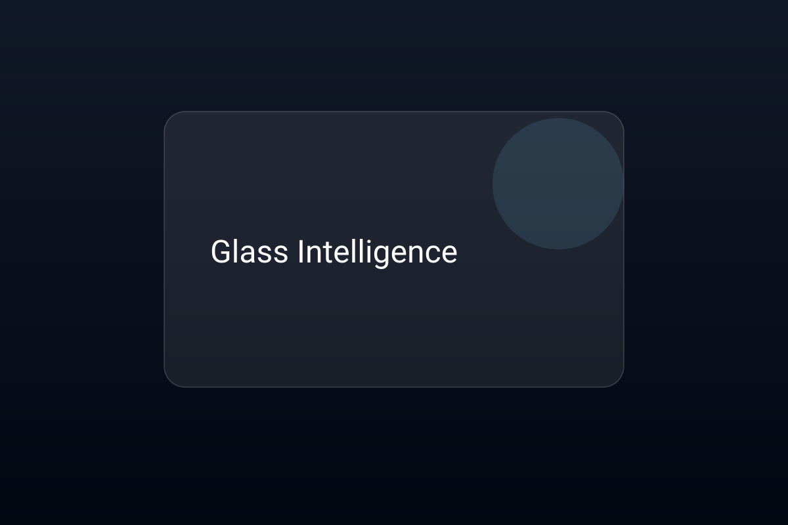
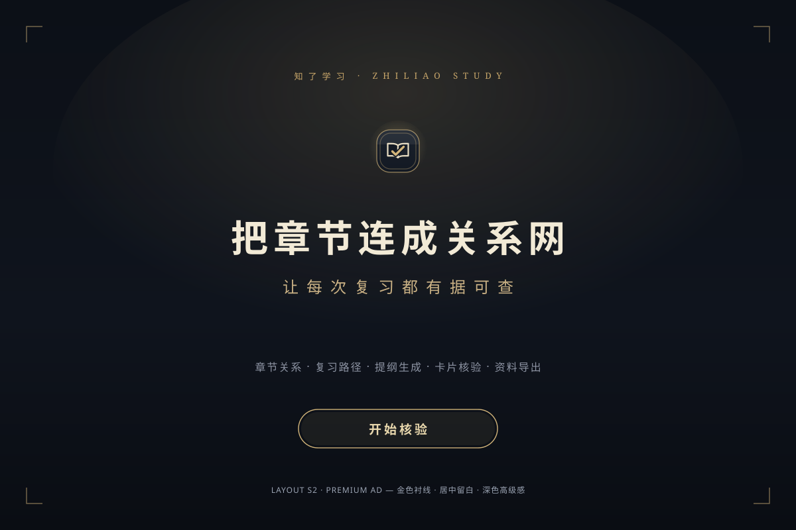

<p align="center">
  
</p>

<p align="center">
  <b>SVG 不是代码片段，而是一套视觉语言。</b><br/>
  AI 生成带设计规则、材质逻辑与排版体系的 SVG 资产 → 用可视化编辑器手工打磨 → 经质量门禁放行。
</p>

<p align="center">
  <a href="https://github.com/jing1312/svg-optimization-skill/actions/workflows/ci.yml"></a>
  
  
</p>

A practical skill for creating and repairing compact SVG assets used in
READMEs, documentation, and product pages. It combines hand-authored
composition with measured typography, semantically selected open-source icon
paths, a design-token system, a JSON-driven SVG generator, and a full visual
editor — all verified by automated quality gates and eval tooling.

---

## Showcase

**同一份内容，一套视觉系统，五种风格语言。** Every figure below is a
hand-authored SVG — no image generators, no design tools, just the workflow
documented in this repository.

### Style breadth — one system, many languages

<p align="center">
  
  <br/>
  <sub>三种语法（流光 / 暖纸压印 / 玻璃器物）的差别在构图、材质与图形语言，不只是换色。</sub>
</p>

<table>
  <tr>
    <td align="center">
      <br>
      <sub>Dreamlight — 漂浮的流光场</sub>
    </td>
    <td align="center">
      <br>
      <sub>Glass Intelligence — 半透明器物面板</sub>
    </td>
    <td align="center">
      <br>
      <sub>Material Craft — 深底金点的材质排版</sub>
    </td>
  </tr>
</table>

### Shipped artifacts — the full editorial workflow

<table>
  <tr>
    <td align="center">
      <br>
      <sub>Banner with edge-entering bubble depth</sub>
    </td>
    <td align="center">
      <br>
      <sub>Popup mockup with measured typography</sub>
    </td>
    <td align="center">
      <br>
      <sub>Detail board: layered material, soft palette</sub>
    </td>
  </tr>
  <tr>
    <td align="center">
      <br>
      <sub>Three complete directions on one brief</sub>
    </td>
    <td align="center">
      <br>
      <sub>Seasonal brand suite, shared tokens</sub>
    </td>
    <td align="center">
      <br>
      <sub>Logo concepts: semantic motif + bounded effects</sub>
    </td>
  </tr>
</table>

Every shipped asset above passes the same automated gates (G1–G4 geometry,
C1 contrast, XML/refs/logo checks). Open any file in `scripts/editor.html` to
see the visual-editor round-trip.

## Why

大多数 AI 生成 SVG 的问题不是"不会画"，而是：元素堆叠没有视觉中心、渐变和
玻璃效果滥用、字体层级混乱、配色没有系统、每次生成都是随机风格。

这个 Skill 把 SVG 设计从"效果生成"升级为"视觉系统生成"：

- **Archetype** — 五种核心视觉语言：Dreamlight / Editorial / Material Craft /
  Glass Intelligence / Mono System
- **Palette** — 颜色是角色不是装饰：surface / ink / accent / material /
  shadow / glow 全部走 token
- **Layout** — Hero / Grid / Poster / Object Showcase，一个主题一个主视觉一个层级

## Quick start

```bash
# 1. Install — copy into your agent's skills folder
cp -r svg-optimization-skill ~/.agents/skills/svg-optimization

# 2. Generate an SVG from a JSON config
echo '{"layout":"banner","palette":"brand","title":"Hello"}' \
  | node scripts/generate-svg.mjs --stdin > output.svg

# 3. Open the visual editor, drag the SVG in, edit by hand (Ctrl+S writes back)
#    scripts/editor.html — double-click to open; Chrome/Edge recommended

# 4. Gate the result
node evals/grade.mjs --check-logo output.svg
```

No runtime dependency is required for normal skill use. Node.js 18 or newer is
needed only for automated checks, generator tooling, and evals.

## Design Token System

所有 SVG 资产的单一数据源（`scripts/tokens.js`）：

| Token 类别 | 值 | 说明 |
|---|---|---|
| 字号阶梯 | 72 / 48 / 32 / 24 / 18 / 13 | Display → Caption |
| 间距系统 | 4 / 8 / 16 / 24 / 32 / 48 / 64 / 96 / 128 | `T.space(n)` 按步取值 |
| 线宽系统 | 1 / 1.5 / 2 / 3 / 4 | Hairline → Heavy |
| 行高比例 | 1.12 / 1.25 / 1.30 / 1.35 / 1.55 / 1.50 | Display → Caption |
| viewBox 尺寸 | banner / card / gallery / poster 等 | 按布局角色命名 |

```js
import { T } from "./scripts/tokens.js";
T.font.title        // 48
T.space(2)          // 16
T.stroke.medium     // 2
T.canvas.banner     // { w: 1100, h: 300 }
```

## SVG Generator

`scripts/generate-svg.mjs` — 输入 JSON 配置，按 token 系统自动计算坐标，输出
合规 SVG。支持 `banner` / `card` / `gallery` / `poster` 四种布局和
`brand` / `dreamlight` / `editorial` / `glass` / `mono` / `earth` 六种配色。

```bash
node scripts/generate-svg.mjs config.json > output.svg
node scripts/generate-svg.mjs --layout banner --palette dreamlight --title "标题" --subtitle "副标题"
```

```js
import { generate } from "./scripts/generate-svg.mjs";
const svg = generate({ layout: "gallery", palette: "editorial", title: "功能展示",
  cols: 3, rows: 2, items: [{ title: "卡片一", subtitle: "描述" }] });
```

## Visual editor

`scripts/editor.html` is a single-file, offline, dependency-free visual editor.
Drag an SVG in, edit it by hand, and Ctrl+S writes back to the same file.

- Full smart snapping: red guide lines (edge/center), live equal-gap badges,
  and same-kind recognition. Hold Ctrl to place freely.
- Double-click text to retype — containers re-measure and re-fit automatically.
- 8-way resize handles for rect / circle / ellipse / text / image **and
  g / path** (anchor-preserving scale transforms — consecutive resizes compose,
  and snapping stays correct under composed transforms).
- Layout templates (布局 dropdown): left-right columns, centered stack,
  title + feature row, diagonal flow — each arrangement is one undo step.
- Component colors follow the theme by default; `🎨 收藏配色` locks a palette
  so new components keep it across themes. The theme choice persists between
  sessions.
- `◐ 体检` runs a WCAG contrast check (3:1 large text / 4.5:1 otherwise),
  marks failures with dashed red boxes and ratio badges; the theme button
  pre-checks contrast before you apply a recolor.
- The mix dropdown (混色) styles new components: solid, vertical band
  gradient, diagonal aurora gradient, or cycling multi-color.
- 12 built-in themes with preview-then-confirm recoloring; PNG 2x/4x export
  (Shift-click trims to content bounds); one-click clean-SVG copy; autosaved
  drafts with restore.
- Shortcuts: arrows nudge, Alt-drag duplicates, Ctrl+Z/Y undo, F focus,
  wheel zoom, Space+drag pan.

Rebuild the artifact after editing `src/editor/*`:

```bash
node scripts/build-editor.mjs
```

### Config previewer (`tools/editor/`)

A separate lightweight previewer for the JSON generator: pick layout / palette /
text and gallery rows, edit the JSON config directly, and export SVG or 2x PNG.
Serve the repo over HTTP (`npx serve .`) and open `/tools/editor/`.

## Workflow

1. Define the visual brief, reading order, and semantic motif using
   `references/design-system.md`.
2. If style is unclear or a redesign is requested, compare two or three
   complete directions from `references/style-system.md` (or the v2 style
   library in `references/style-library.md`) and let the user pick.
3. Choose the canvas and layout, then assign color, typography, spacing, and
   material roles from the shared design system.
4. Measure visible strings with `scripts/measure_text.html`.
5. Source a relevant glyph from Lucide, Tabler, or Phosphor and record its
   license — or derive tokens with `scripts/tokens.js`.
6. Build and render the SVG in a browser, or generate a base with
   `scripts/generate-svg.mjs`.
7. Add motion only when it explains state or progress, with a static fallback.
8. Inspect at intrinsic and small sizes, compare against the incumbent, and
   apply the anti-pattern gate.
9. Run the automated checks.

## Validation

SVG 输出经过四道关口：Design Intent → Structural Validation → Aesthetic
Review → Release。前三道由 agent 自检执行，最后一道跑自动化检查：

```bash
npm test
npm run check

# Quality gates over examples/ and docs/ (XML, refs, logo, blur, motifs,
# geometry G1–G4, contrast C1)
node evals/grade.mjs

# Check one logo-bearing SVG
node evals/grade.mjs --check-logo assets/examples/banner-example.svg

# Grade a generated eval workspace
node evals/grade.mjs --workspace ./my-eval-workspace --iteration iteration-1
node evals/aggregate.mjs --workspace ./my-eval-workspace --iteration iteration-1
node evals/viewer.mjs --workspace ./my-eval-workspace --iteration iteration-1
```

The eval workspace defaults to `.eval-workspace/` and can also be set with
`SVG_EVAL_WORKSPACE`.

## AI Design Rules

生成前必须回答：这个 SVG 要传达什么？核心视觉元素是什么？每个材质为什么存在？

禁止：随机光球、无意义渐变、玻璃效果堆叠、元素拼贴、模板化卡片布局。

> 高级感来自控制，而不是增加。

## Local preference controls

Persistence is opt-in. When enabled, the profile stays outside this repository
and stores only small numeric weights for known style dimensions. It never
stores prompts, raw feedback, project content, URLs, or local paths.

```bash
node scripts/preferences.mjs show
node scripts/preferences.mjs forget --key material.glass
node scripts/preferences.mjs reset
```

On hosts without a writable profile, keep preferences in the current session.

## Repository layout

```text
assets/examples/             Browser-verified banner, mockup, logo, and style choices
brand-packs/                 Frozen brand pack (zhiliao-study)
docs/                        Specs, plans, and hero/effect figures
examples/                    v2 visual reference standards + brand-pack renders
evals/                       Quality gates (grade.mjs), workspace grader, aesthetic scoring
memory/                      Design memory: successful compositions and rejected rules
references/                  Design system, style library, logo system, tokens, typography…
scripts/                     tokens.js, generate-svg.mjs, render.mjs, measure_text.html,
                             preferences.mjs, build-editor.mjs
src/editor/                  Visual editor modules (built into scripts/editor.html)
tools/editor/                Config-driven previewer for the generator
SKILL.md                     Agent workflow and delivery checklist
PRIVACY.md                   Rules for safe public artifacts
THIRD_PARTY_NOTICES.md       Icon licenses and attribution
```

## Privacy

Do not store raw conversations, original user feedback, internal handoff
notes, private prompts, local paths, or secrets in this repository. Convert
useful feedback into anonymous, reusable guidance. See `PRIVACY.md`.

## Philosophy

> 门禁保证 SVG 不坏。设计系统保证 SVG 不普通。

这个项目不是 SVG 模板库，它是一套让 AI 理解视觉设计的方法。

## License

Project code and documentation are MIT licensed. Embedded Lucide icon paths
are available under the ISC license; see `THIRD_PARTY_NOTICES.md` and the
bundled `LICENSE` file.
