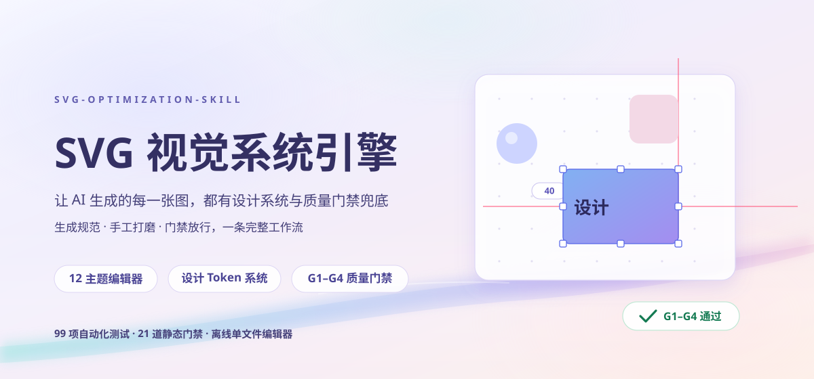
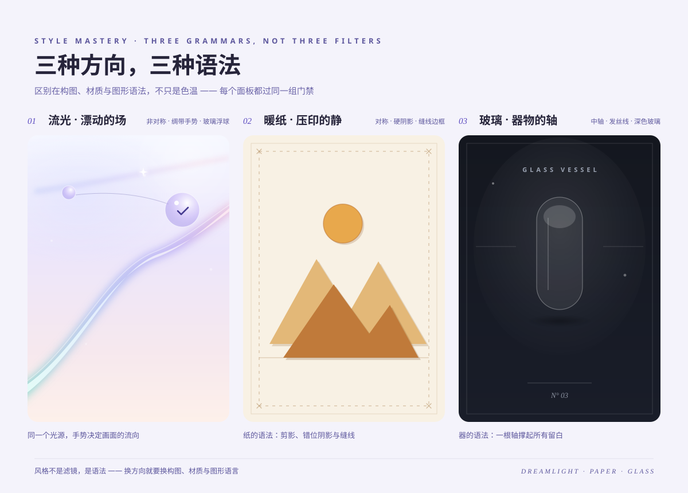
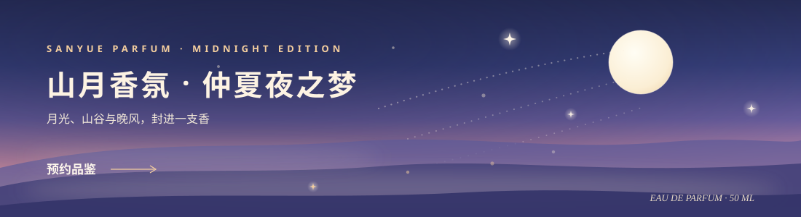
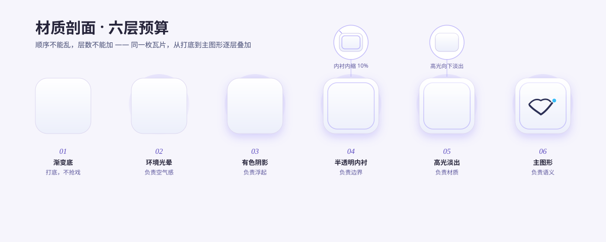

<div align="center">
  
</div>

<div align="center">

# svg-optimization-skill

### 把 SVG 画得好看，且**查得出 bug**。

跨 agent 通用 · 多风格可推导 · 零运行时依赖 · 机器门禁 + 渲染实测。

[](https://github.com/jing1312/svg-optimization-skill/actions/workflows/ci.yml)
[](LICENSE)
[](package.json)

</div>

这是一个 **Agent Skill**：告诉 AI agent 怎么设计 SVG（语义化图案、六层效果预算、
风格推导），并配一套零依赖的机器门禁与渲染验证闭环，把「文字溢出、图案遮挡、
断引用、低对比度」这些经典翻车变成**可被自动拦截的错误**，而不是靠运气。

## 它解决什么

品牌 SVG 资产最常见的五种翻车，这里都有硬规则 + 机器检查：

| 翻车 | 这个技能怎么做 | 谁来执行 |
|---|---|---|
| 装饰靠随机，拼贴感 | 每个主图案先写三行 brief（message / nouns / relationship），讲不清就删 | `design-principles.md` §1 |
| 文字溢出容器/画布 | 几何门禁 G1–G4：完整仿射变换、path 包围盒、容器适配 | `evals/grade.mjs` |
| 渐变断引用、重复 id | 引用门禁 R1/R2：每个 `url(#x)` 必须有且仅有一个目标 | `evals/grade.mjs` |
| 风格每次重摇 | 六个风格**原型** + 从品牌主色的推导规则，而不是背色板 | `style-library.md` |
| “看着挺好”其实看不清 | 对比度门禁 C1（按绘制顺序解析背景、支持渐变/半透明合成） | `evals/grade.mjs` |

## 验证是分层降级的（关键设计）

不同 agent 环境能力不同，验证分三层，用能用的最高层：

```text
T0  静态自查（任何环境，零工具）—— 对照 references/verification.md §2 走查源文件
T1  机器门禁（需要 Node ≥ 18）—— node evals/grade.mjs：XML/引用/几何/对比度
T2  渲染实测（需要任一光栅化器）—— node scripts/render.mjs：Playwright → Chromium → rsvg-convert
```

T1 通过 ≠ 完成；有 T2 可用却跳过，就不算完成。没有任何光栅化器时，脚本会明确
提示降级到 T0 并如实声明——**门禁不会骗你说“都检查过了”**。

## 效果一览（仓库内 SVG 直出）

<div align="center">
  
  <br/>
  <sub><strong>风格原型画廊</strong> —— Flat / Aurora / Glass / Neon / Ink / Editorial，同一套门禁下的六种材质纪律。</sub>
</div>

<div align="center">
  
  <br/>
  <sub><strong>通用示例 banner（1100×300）</strong> —— 从品牌主色 <code>#c2410c</code> 推导整套色板，与任何内置品牌无关。</sub>
</div>

<table>
  <tr>
    <td width="58%" valign="top">
      
      <br/>
      <sub><strong>品牌包示例</strong> —— 内置演示品牌「知了学习」，展示固定文案下的季节换色与语义 Logo。</sub>
    </td>
    <td width="42%" valign="top">
      
      <br/>
      <sub><strong>六层效果预算</strong> —— 顺序不能乱，层数不能加；空气感靠预算，不靠堆叠。</sub>
    </td>
  </tr>
</table>

## 快速开始

### 交给 Agent（推荐）

```text
请安装这个 Agent Skill：https://github.com/jing1312/svg-optimization-skill
先审查 SKILL.md 与 references/，再整目录安装到你的 skills 目录。
```

### 手动安装

```bash
git clone https://github.com/jing1312/svg-optimization-skill.git
# Claude Code / Codex 等支持 skill 目录的 agent：
cp -R svg-optimization-skill ~/.claude/skills/
# 其他 agent：把 SKILL.md 作为系统提示引入即可，references/ 按需读取。
```

### 本地验证（零依赖，Node ≥ 18）

```bash
npm test        # 24 项：门禁行为 + 仓库结构 + 隐私扫描
npm run check   # 门禁跑过 examples/ 与 docs/ 下全部 16 个 SVG
node evals/grade.mjs path/to/any.svg   # 单独评估任意文件，出错退出码非零
node scripts/render.mjs path/to/any.svg  # T2 渲染（自动探测 playwright/chromium/rsvg）
```

### 常用问法

| 场景 | 你可以这样问 |
|---|---|
| 新建资产 | “给产品做 1100×300 推广 banner，品牌色 #1f6feb。” |
| 风格未定 | “重新设计，先给我几个方向选。” |
| 修 bug | “帮我查一下这张 SVG 有没有溢出或断引用。” |
| 品牌推导 | “我们的主色是 #d94f30，帮我推一套浅色主题。” |
| Logo | “Logo 要经得起 48px 缩小，把层次补齐。” |

## 目录结构

```text
SKILL.md                # 技能契约：触发条件、五步工作流、三层验证
references/
  design-principles.md  # 图案 brief、六层预算、G1–G4、Logo 规则
  style-library.md      # 六原型 + 品牌色推导规则（风格不是摇骰子）
  typography.md         # 字体栈、宽度估算、fallback 与描边交付策略
  verification.md       # T0 自查清单 + T2 渲染目检清单
brand-packs/
  zhiliao-study.md      # 内置演示品牌（固定文案 + 季节主题注册表 + Logo 实例）
evals/grade.mjs         # 零依赖门禁引擎（XML/R1/R2/G1–G4/C1/W1）
scripts/render.mjs      # T2 渲染脚本（playwright → chromium → rsvg-convert 降级）
examples/               # 通用示例与演示品牌资产（全部门禁绿灯）
tests/                  # 24 项测试；fixtures 为每个门禁各备一个“必定失败”的坏样本
```

## 设计立场

- **门禁查结构，人眼管审美。** 门禁能保证资产“没坏”，不能保证“好看”；
  所以 SKILL.md 强制要求：有渲染条件就必须渲染目检，并如实说明检查了什么。
- **示例必须过自己的门禁。** 仓库里 16 个 SVG 全部在 CI 里跑过 G1–G4、R1/R2、C1。
- **风格可推导。** 给一个品牌主色，按 `style-library.md §3` 推出整套 token，
  而不是从预制色板里碰运气。
- **用户偏好属于会话记忆。** 本技能不持久化任何用户数据；跨会话保留口味需用户
  明确同意，且随时可撤销。

## 许可

项目本体 [ISC](LICENSE)；演示品牌 Logo glyph 改编自 Lucide `book-open-check`
（同为 ISC），归属见 [`THIRD_PARTY_NOTICES.md`](THIRD_PARTY_NOTICES.md)。
欢迎 Issue / PR：新风格原型、更强的门禁、新品牌包示例都可以。
